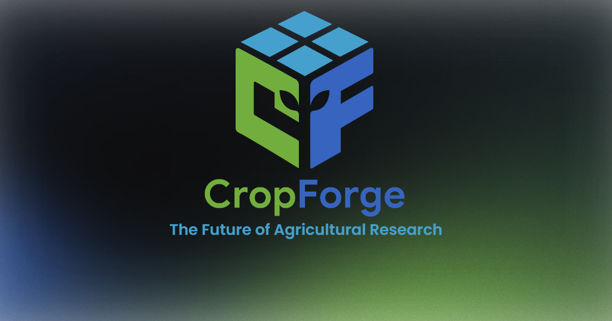

# CropForge

**Open-source crop simulation runtime. Built for computational agriculture.**



## Overview

CropForge is a modern crop simulation and modeling runtime developed by Saswat Sundar Rath at ICAR-IARI Jharkhand. It enables researchers, agronomists, and developers to easily run complex agricultural simulations in a highly optimized and developer-friendly environment.

- **Website:** [cropforge.org](https://cropforge.org)
- **Author:** Saswat Sundar Rath (saswatsundar123@gmail.com)
- **License:** MIT

## Quickstart

```bash
$ pip install cropforge
```

```python
import cropforge

# Create a simulation environment
farm = cropforge.Farm("ICAR-Plot")

# Run the simulation
farm.run(days=90)
```

## Features

- **Extensible Simulation Models:** Plug-and-play architecture for custom crop traits.
- **Fast Execution Engine:** Built for large-scale geospatial agricultural simulations.
- **Developer First:** Clean API, deep documentation, and rich Python integration (3.12+).

## Repository Structure

This repository holds the source code for the **CropForge promotional and documentation website** (hosted at `cropforge.org`), featuring:
- High-performance, no-framework vanilla HTML/CSS/JS frontend.
- Interactive WebGL-backed ASCII art engine.
- Minimalist terminal-inspired design system.

## License

This project is licensed under the MIT License - see the [LICENSE](LICENSE) file for details.
